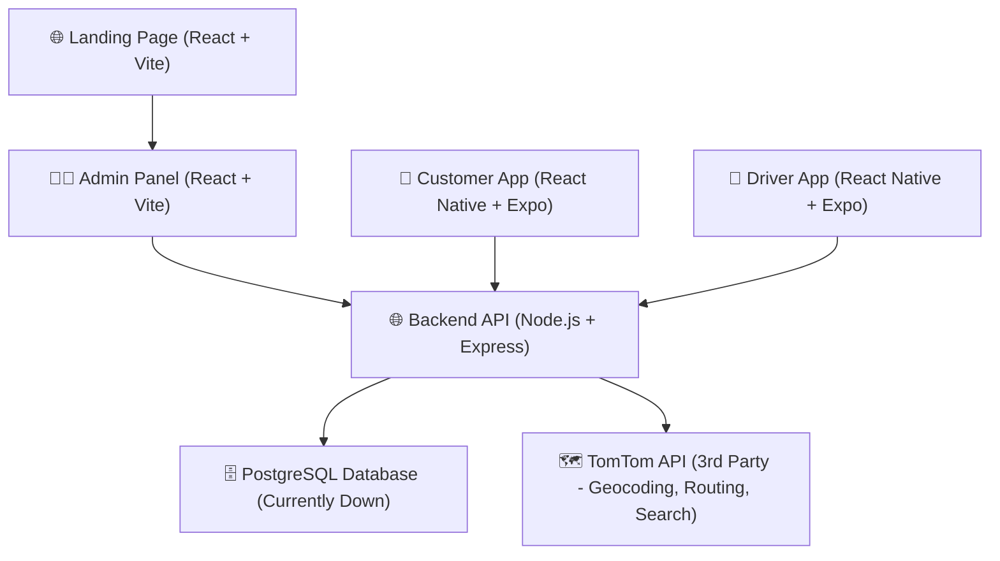

<div align="center">
  <table border="0" cellpadding="0" cellspacing="0" style="border: none;">
    <tr>
      <td style="border: none; padding-right: 10px;"></td>
      <td style="border: none;"><h1>Parfly</h1></td>
    </tr>
  </table>
</div>
<p align="center">Multi-User Courier Management System with Driver & Customer Apps + Web Admin Panel</p>

<p align="center">
  
  
  
  
  
  
</p>

<div align="center">
  <h3>🚀 Choose Your Path:</h3>
  <p>
    <a href="#-quick-demo-for-hiring-managers--testers"><strong>👔 I'm a Hiring Manager/Tester</strong></a> | 
    <a href="#%EF%B8%8F-setup-instructions-for-developers--students"><strong>👨‍💻 I'm a Developer/Student</strong></a>
  </p>
</div>

---

## 🧭 Overview

**Parfly** is a courier delivery platform that connects **customers** with **third-party drivers** for fast, same-day parcel delivery. It features:

- 📱 Customer & Driver mobile apps (React Native + Expo)
- 🖥 Web-based Admin Dashboard
- 🌐 Landing Page
- 🧠 Real-time tracking powered by **TomTom Maps API**

> Inspired by apps like [Lalamove](https://www.lalamove.com/en-ph/) and Maxim.

---

<details open> <summary>
📱 System Architecture
</summary>

**Parfly** follows a **Client-Server Architecture** with multiple client applications communicating with a centralized backend server. The system is designed as a **multi-tier architecture** with clear separation between presentation, business logic, and data layers.

### Architecture Pattern: Client-Server + RESTful API
- **Multiple Clients**: Web applications and mobile apps serve as presentation layer
- **Centralized Server**: Node.js/Express backend handles business logic and API endpoints
- **Database Layer**: PostgreSQL manages persistent data storage
- **External Services**: Third-party APIs for specialized functionality


```mermaid
graph TD
    A1["🌐 Landing Page (React + Vite)"]
    A2["🧑‍💻 Admin Panel (React + Vite)"]
    A3["📱 Customer App (React Native + Expo)"]
    A4["🚚 Driver App (React Native + Expo)"]
    B["🌐 Backend API (Node.js + Express)"]
    C["🗄 PostgreSQL Database (Currently Down)"]
    D["🗺 TomTom API (3rd Party - Geocoding, Routing, Search)"]

    A1 --> A2
    A2 --> B
    A3 --> B
    A4 --> B
    B --> C
    B --> D
```

### Key Architectural Benefits:
- **Scalability**: Multiple clients can connect to the same backend
- **Maintainability**: Clear separation of concerns across layers
- **Flexibility**: Easy to add new client applications or modify existing ones
- **Security**: Centralized authentication and business logic validation
</details>

---

## 👤 Roles & Permissions

| Role         | Permissions & Capabilities                                                                 |
|--------------|---------------------------------------------------------------------------------------------|
| **Customer** | - Request deliveries<br>- Track delivery status<br>- View delivery history                  |
| **Driver**   | - Register via app<br>- Accept deliveries<br>- Update delivery status |
| **Admin**    | - Manage customers and drivers<br>- Monitor all deliveries<br>- Handle reports and operations |

---

## ✨ Features

* 📦 **Same-Day Parcel Booking**
* 📍 **Real-Time Tracking (Drivers & Parcels)**
* 🧾 **Delivery History & Status Updates**
* 🧠 **Admin Dashboard for Full Management**
* 🔐 **Role-Based Authentication & Authorization**
* 🔔 **Delivery Notifications (Status Updates)**
* 🛻 **Third-Party Driver Support (Bring Your Own Vehicle)**
* 🌐 **Public Landing Page for Service Info**

---

## 🚧 Limitations

* 🌍 Delivery limited to local areas (no international shipping yet)
* 💳 Payment support limited to Cash on Delivery and basic online methods
* 🏢 No company-owned vehicles (drivers must use their own)

---

## 🛠️ Tech Stack

<p align="center">
  
</p>

**Frontend:**
- Customer App (React Native + Expo)
- Driver App (React Native + Expo)
- Admin Panel & Landing Page (React + Vite)

**Backend:**
- Node.js + Express.js

**Database:**
- PostgreSQL (Local development, hosted solutions for production)

**APIs:**
- TomTom API (Reverse Geocoding, Search, Routing)

**Hosting & Deployment:**
- 🌐 **Admin Panel**: [Netlify](https://parfly.netlify.app/admin) - ✅ Currently Live (Optimized for production)
- 🌐 **Landing Page**: [Netlify](https://parfly.netlify.app) - ✅ Currently Live
- 🔙 **Backend API**: [Render](https://render.com) - ✅ Currently Live (Free tier)
- 🗄️ **Database**: ❌ Currently Down *(Render's free tier limitation - use local PostgreSQL for development)*
- 📱 **Mobile Apps**: Expo Go *(Development mode - APK/IPA builds not yet available)*

> **For Students**: The production setup uses free hosting tiers, making it perfect for learning deployment without costs. Environment variables are configured on each hosting platform.

---

## 🎯 Objectives

1. Enable real-time tracking of drivers and parcels
2. Implement role-based access (Admin, Driver, Customer)
3. Provide seamless delivery booking and management
4. Use analytics for decision-making (admin reports)
5. Ensure security and authentication for all users

---

## 📷 Screenshots

<details open>
<summary>📱 Customer App Screenshots</summary>

<div align="center">


</div>

</details>

<details open>
<summary>🚚 Driver App Screenshots</summary>

<div align="center">


</div>

</details>

---

## 🚀 Quick Demo (For Hiring Managers & Testers)

> **Perfect for:** Hiring managers, non-technical stakeholders, or anyone who wants to quickly see what Parfly can do without setting up development environments.

Want to test the app without setting up the code? Here's how:

### 🌐 Live Web Demo
- **Admin Panel**: [Visit Live Demo](https://parfly.netlify.app/admin) ✅ **Currently Live**
- **Landing Page**: [Browse Public Website](https://parfly.netlify.app) ✅ **Currently Live**

**What you can test:**
- ✅ Browse the public landing page
- ⚠️ Admin dashboard (limited functionality due to database being down)
- ✅ View frontend interface and UI components
- ⚠️ Real-time tracking features (backend works, but data storage limited)

### 📱 Mobile App Testing (Zero Setup Required)
1. **Install Expo Go** on your phone (free app):
   - [📱 Android - Google Play](https://play.google.com/store/apps/details?id=host.exp.exponent)
   - [🍎 iOS - App Store](https://apps.apple.com/app/expo-go/id982107779)

2. **Test the Apps** (Scan QR codes):
   - **Customer App**: [Request QR Code](#) *(Contact developers for current link)*
   - **Driver App**: [Request QR Code](#) *(Contact developers for current link)*

3. **Test Features Without Coding**:
   - ✅ Create delivery requests as a customer
   - ✅ Track deliveries in real-time
   - ✅ View driver locations on map
   - ✅ Experience the complete user journey
   - ✅ Test notifications and status updates

**Demo Credentials** (for live admin panel):
```
Email: admin@parfly.demo
Password: demo123
```
*Note: This is a demo environment. Database is currently down due to Render's free tier limitations, so some features may not work fully.*

### 📞 Need Help Testing?
- **Contact**: [Create an issue](https://github.com/yourusername/parfly/issues) or email the development team
- **Video Demo**: Watch our 3-minute demo video *(Coming soon)*
- **Live Support**: Available during development hours (mention in issues)

> **Note**: Mobile apps are currently in development mode via Expo Go. Production APK/IPA builds are planned for future release.

---

## 🛠️ Setup Instructions for Developers & Students

<details>
<summary><strong>Click to expand setup guide</strong></summary>

> **Perfect for:** Computer science students, developers, and anyone who wants to understand, modify, or contribute to the Parfly codebase.

> **⚠️ Current Status**: The production database is currently down due to Render's free tier limitations. For full functionality, please set up a local PostgreSQL database following the instructions below.

### 👋 For Students & New Developers

This guide is written with students in mind! Don't worry if you're new to development - we'll walk through everything step by step.

**🎯 Learning Objectives:**
- ✅ Set up a full-stack development environment
- ✅ Understand PERN stack architecture (PostgreSQL, Express, React, Node.js)
- ✅ Work with React Native and Expo for mobile development
- ✅ Learn API integration and real-time features
- ✅ Practice with modern development tools and workflows

### 📋 What You'll Need (Prerequisites)

<details>
<summary><strong>📥 Required Software (Click to expand)</strong></summary>

**Essential Tools:**
1. **Node.js** (v18+) - [Download here](https://nodejs.org/) - *The JavaScript runtime*
2. **Git** - [Download here](https://git-scm.com/) - *Version control*
3. **PostgreSQL** - [Download here](https://www.postgresql.org/download/) - *Database*
4. **VS Code** - [Download here](https://code.visualstudio.com/) - *Code editor (recommended)*

**For Mobile Development:**
5. **Expo CLI** - Install with: `npm install -g @expo/cli`
6. **Expo Go App** on your phone - [Android](https://play.google.com/store/apps/details?id=host.exp.exponent) | [iOS](https://apps.apple.com/app/expo-go/id982107779)

**Optional (for advanced mobile dev):**
- **Android Studio** - For Android development
- **Xcode** - For iOS development (macOS only)

</details>

### 🚀 Quick Start

#### 🎯 Option 1: Automated Setup (Recommended for Beginners)

**Super Easy Setup - Just Run One Command!**

```bash
# For Linux/macOS users:
bash setup.sh

# For Windows users:
setup.bat
```

This script will:
- ✅ Install all dependencies
- ✅ Create environment files
- ✅ Set up the database
- ✅ Give you next steps

#### 🔧 Option 2: Manual Setup (For Learning)

Perfect if you want to understand what's happening under the hood!

<details>
<summary><strong>Step 1: Get the Code</strong></summary>

```bash
# Clone the repository
git clone https://github.com/yourusername/parfly.git
cd parfly

# Or download as ZIP from GitHub and extract
```
</details>

<details>
<summary><strong>Step 2: Database Setup (Important!)</strong></summary>

**Why Local Database?** 
We use local PostgreSQL because Render's free tier only lasts 2 months per account.

**For Windows Users:**
1. Download PostgreSQL from [here](https://www.postgresql.org/download/windows/)
2. During installation, remember your password!
3. Open "pgAdmin" (comes with PostgreSQL)
4. Create a new database called `parfly_db`

**For macOS Users:**
```bash
# Install via Homebrew (easier)
brew install postgresql
brew services start postgresql

# Create database
createdb parfly_db
```

**For Linux Users:**
```bash
# Ubuntu/Debian
sudo apt update
sudo apt install postgresql postgresql-contrib

# Start PostgreSQL
sudo systemctl start postgresql

# Create database
sudo -u postgres createdb parfly_db
```

**Import the Database Schema:**
```bash
# Navigate to project folder
cd parfly

# Import the schema (creates all tables and sample data)
psql -U your_username -d parfly_db -f database_schema.sql

# If you get permission errors, try:
sudo -u postgres psql -d parfly_db -f database_schema.sql

# Verify import worked (should show tables like users, drivers, deliveries)
psql -U your_username -d parfly_db -c "\dt"
```

**🔍 Verify Database Setup:**
```bash
# Test connection
psql -U your_username -d parfly_db -c "SELECT COUNT(*) FROM users;"

# Should return: count: 0 (or some number if sample data was included)
```

</details>

<details>
<summary><strong>1. Clone the Repository</strong></summary>

```bash
git clone https://github.com/yourusername/parfly.git
cd parfly
```
</details>

<details>
<summary><strong>2. Backend Setup</strong></summary>

Navigate to the backend directory and install dependencies:

```bash
cd Parfly-Backend
npm install
```

Create a `.env` file in the `Parfly-Backend` directory with the following variables:

```env
# Database Configuration
PG_USER=your_postgres_username
PG_HOST=localhost
PG_DATABASE=parfly_db
PG_PASSWORD=your_postgres_password
PG_PORT=5432

# JWT Secret
JWT_SECRET=your_jwt_secret_key_here

# TomTom API Key (for location services)
TOMTOM_API_KEY=your_tomtom_api_key

# Server Configuration
PORT=3001
NODE_ENV=development
```

**Database Setup:**

1. Create a PostgreSQL database named `parfly_db`
2. Import the database schema: `psql -U your_username -d parfly_db -f database_schema.sql`
3. Ensure your PostgreSQL server is running

Start the backend server:

```bash
npm run dev
# or for production
npm start
```

The backend server will run on `http://localhost:3001`
</details>

<details>
<summary><strong>3. Admin Panel Setup</strong></summary>

Navigate to the admin panel directory:

```bash
cd ../Parfly-Admin
npm install
```

Start the development server:

```bash
npm run dev
```

The admin panel will be available at `http://localhost:5173`
</details>

<details>
<summary><strong>4. Customer Mobile App Setup</strong></summary>

Navigate to the customer app directory:

```bash
cd ../Parfly-Customer-App
npm install
```

Create a `.env` file in the `Parfly-Customer-App` directory:

```env
EXPO_PUBLIC_API_URL=http://localhost:3001/api
EXPO_PUBLIC_GOOGLE_MAPS_API_KEY=your_google_maps_api_key
```

Start the Expo development server:

```bash
npx expo start
```

Follow the Expo CLI instructions to run on:
- **Android**: Scan QR code with Expo Go app or run `npx expo start --android`
- **iOS**: Scan QR code with Camera app or run `npx expo start --ios`
- **Web**: Press `w` in the terminal or run `npx expo start --web`
</details>

<details>
<summary><strong>5. Driver Mobile App Setup</strong></summary>

Navigate to the driver app directory:

```bash
cd ../Parfly-Driver-App
npm install
```

Create a `.env` file in the `Parfly-Driver-App` directory:

```env
EXPO_PUBLIC_API_URL=http://localhost:3001/api
EXPO_PUBLIC_GOOGLE_MAPS_API_KEY=your_google_maps_api_key
```

Start the Expo development server:

```bash
npx expo start
```
</details>

### 🔑 API Keys Setup

<details>
<summary><strong>TomTom API Key</strong></summary>

1. Go to [TomTom Developer Portal](https://developer.tomtom.com/)
2. Create an account and generate an API key
3. Add it to your backend `.env` file as `TOMTOM_API_KEY`
</details>

<details>
<summary><strong>Google Maps API Key</strong></summary>

1. Go to [Google Cloud Console](https://console.cloud.google.com/)
2. Create a new project or select existing one
3. Enable the following APIs:
   - Maps SDK for Android
   - Maps SDK for iOS
   - Places API
   - Geocoding API
4. Create credentials (API Key)
5. Add it to your mobile app `.env` files as `EXPO_PUBLIC_GOOGLE_MAPS_API_KEY`
</details>

### 📱 Mobile Development Setup

<details>
<summary><strong>Android Development</strong></summary>

1. Install [Android Studio](https://developer.android.com/studio)
2. Set up Android SDK and emulator
3. Configure environment variables (`ANDROID_HOME`, etc.)
</details>

<details>
<summary><strong>iOS Development (macOS only)</strong></summary>

1. Install [Xcode](https://developer.apple.com/xcode/) from App Store
2. Install iOS Simulator
3. Set up Apple Developer account (for device testing)
</details>

### 🚦 Development Workflow

**🎯 Recommended Development Order:**
1. **Start Backend**: `cd Parfly-Backend && npm run dev` (Port 3001)
2. **Start Admin Panel**: `cd Parfly-Admin && npm run dev` (Port 5173)
3. **Start Customer App**: `cd Parfly-Customer-App && npx expo start`
4. **Start Driver App**: `cd Parfly-Driver-App && npx expo start`

**💡 Pro Tips for Students:**
- Always start the backend first - apps depend on it
- Use separate terminals for each service
- Check browser console and terminal logs for errors
- Use browser developer tools to inspect network requests
- Test API endpoints with Postman/Thunder Client before integrating

**📁 Understanding the Codebase:**
- **Backend**: RESTful API server (controllers → routes → services pattern)
- **Admin**: Web dashboard using React + Vite (fast development)
- **Mobile Apps**: React Native with Expo (cross-platform mobile development)
- **Database**: PostgreSQL with proper relationships and constraints

### 🐛 Troubleshooting

<details>
<summary><strong>Common Issues & Student-Friendly Solutions</strong></summary>

1. **Database Connection Error**
   - ❌ Error: `ECONNREFUSED` or `role does not exist`
   - ✅ **Solution**: 
     ```bash
     # Check if PostgreSQL is running
     # Windows: Look for "postgresql" in Task Manager
     # macOS/Linux: sudo systemctl status postgresql
     
     # Reset database user
     sudo -u postgres createuser --superuser your_username
     ```

2. **API Key Issues**
   - ❌ Error: `Invalid API key` or map not loading
   - ✅ **Solution**: 
     - Double-check API keys in `.env` files
     - Ensure no extra spaces in API keys
     - Check API key permissions in respective dashboards

3. **Mobile App Won't Load**
   - ❌ Error: `Network request failed`
   - ✅ **Solution**:
     ```bash
     # Make sure backend is running first
     cd Parfly-Backend && npm run dev
     
     # Check if you can access: http://localhost:3001/api
     # Update API URL in mobile app .env files
     ```

4. **Port Already in Use**
   - ❌ Error: `EADDRINUSE: address already in use`
   - ✅ **Solution**:
     ```bash
     # Find and kill process using port
     # Windows:
     netstat -ano | findstr :3001
     taskkill /PID <process_id> /F
     
     # macOS/Linux:
     sudo lsof -i :3001
     sudo kill -9 <process_id>
     ```

5. **Node Modules Issues**
   - ❌ Error: `Module not found` or dependency conflicts
   - ✅ **Solution**:
     ```bash
     # Clean install
     rm -rf node_modules package-lock.json
     npm install
     
     # If still issues, try:
     npm install --legacy-peer-deps
     ```

6. **Expo/React Native Issues**
   - ❌ App crashes or won't start
   - ✅ **Solution**:
     ```bash
     # Clear Expo cache
     npx expo start --clear
     
     # Reset Metro bundler
     npx expo start --reset-cache
     ```

**🆘 Still Stuck?**
- Check our [GitHub Issues](https://github.com/yourusername/parfly/issues)
- Ask questions in our [Discussions](https://github.com/yourusername/parfly/discussions)
- For students: Include your OS, Node version, and error messages when asking for help

**🎓 Learning Resources:**
- [PostgreSQL Tutorial](https://www.postgresql.org/docs/current/tutorial.html)
- [React Documentation](https://react.dev/)
- [Express.js Guide](https://expressjs.com/en/starter/hello-world.html)
- [React Native Tutorial](https://reactnative.dev/docs/tutorial)

</details>

### 🔄 Environment Variables Summary

<details>
<summary><strong>Backend (.env)</strong></summary>

```env
PG_USER=your_postgres_username
PG_HOST=localhost
PG_DATABASE=parfly_db
PG_PASSWORD=your_postgres_password
PG_PORT=5432
JWT_SECRET=your_jwt_secret_key_here
TOMTOM_API_KEY=your_tomtom_api_key
PORT=3001
NODE_ENV=development
```
</details>

<details>
<summary><strong>Mobile Apps (.env)</strong></summary>

```env
EXPO_PUBLIC_API_URL=http://localhost:3001/api
EXPO_PUBLIC_GOOGLE_MAPS_API_KEY=your_google_maps_api_key
```
</details>

### 🎓 For Students: Key Learning Areas

<details>
<summary><strong>What You'll Learn by Building/Modifying Parfly</strong></summary>

**🔧 Technical Skills:**
- **Full-Stack Development**: PERN stack (PostgreSQL, Express, React, Node.js)
- **Mobile Development**: React Native, Expo, cross-platform development
- **Database Design**: Relational databases, SQL, migrations, relationships
- **API Development**: RESTful APIs, authentication, CRUD operations
- **Real-Time Features**: Location tracking, live updates
- **External APIs**: Maps integration, geocoding, routing

**💼 Industry Practices:**
- **Version Control**: Git workflows, branching, collaboration
- **Environment Management**: Local vs. production environments
- **Security**: JWT authentication, environment variables, data validation
- **Deployment**: Web hosting, mobile app distribution, CI/CD concepts
- **Testing**: API testing, debugging, error handling

**🏗️ Software Architecture:**
- **Separation of Concerns**: Frontend, backend, database layers
- **Component-Based Architecture**: Reusable UI components
- **State Management**: Local state, global state, data flow
- **Code Organization**: Modular structure, clean code principles

**📚 Academic Applications:**
- **Capstone Projects**: Ready-to-extend platform for final projects
- **Database Coursework**: Real-world schema design and optimization
- **Software Engineering**: Complete SDLC example with documentation
- **Mobile Computing**: Cross-platform development case study
- **Web Development**: Modern frameworks and deployment practices

</details>

</details>

---

## 🗄️ Database Schema

<details>
<summary><strong>Click to expand database information</strong></summary>

The Parfly application uses PostgreSQL with the following table structure:

### Tables Overview

- **`users`** - General user information (customers, drivers, admins)
- **`drivers`** - Driver-specific data and vehicle information  
- **`deliveries`** - Delivery records and tracking information
- **`notifications`** - User notifications system
- **`ratings`** - Customer feedback and driver ratings
- **`tracking`** - Real-time location tracking for drivers

### Quick Database Setup

1. **Create Database**:
   ```bash
   createdb parfly_db
   ```

2. **Run Schema Script**:
   ```bash
   psql -U your_username -d parfly_db -f database_schema.sql
   ```

### Key Relationships

- **Users** → **Drivers**: One-to-one (drivers are specialized users)
- **Users** → **Deliveries**: One-to-many (users can send/receive multiple deliveries)  
- **Drivers** → **Deliveries**: One-to-many (drivers can handle multiple deliveries)
- **Deliveries** → **Ratings**: One-to-one (each delivery can have one rating)
- **Deliveries** → **Tracking**: One-to-many (multiple tracking points per delivery)

### Delivery Status Flow

```
pending → accepted → picked_up → in_transit → delivered → completed
```

### User Roles

- **`customer`**: Can create delivery requests and track orders
- **`driver`**: Can accept deliveries and update status  
- **`admin`**: Full system access for management

The complete schema is available in [`database_schema.sql`](database_schema.sql)

</details>

---

## 🔗 API Documentation

<details>
<summary><strong>Click to expand API reference</strong></summary>

The Parfly backend provides RESTful APIs for all client applications. Here are the main endpoint categories:

#### Authentication Endpoints
```
POST /api/register          # General user registration
POST /api/login             # General user login
POST /api/register/driver   # Driver-specific registration  
POST /api/login/driver      # Driver authentication
POST /api/register/customer # Customer registration
POST /api/login/customer    # Customer authentication
```

#### Customer Endpoints
```
GET    /api/customers       # Get all customers (admin)
GET    /api/customers/:id   # Get customer by ID
PUT    /api/customers/:id   # Update customer
DELETE /api/customers/:id   # Delete customer
```

#### Driver Endpoints
```
GET    /api/drivers         # Get all drivers (admin)
GET    /api/drivers/:id     # Get driver by ID
PUT    /api/drivers/:id     # Update driver
DELETE /api/drivers/:id     # Delete driver
POST   /api/drivers/toggle-status  # Toggle driver availability
```

#### Delivery Endpoints
```
GET    /api/deliveries      # Get all deliveries
POST   /api/deliveries      # Create new delivery
GET    /api/deliveries/:id  # Get delivery by ID
PUT    /api/deliveries/:id  # Update delivery
DELETE /api/deliveries/:id  # Delete delivery
```

#### Location & Search
```
GET    /api/search-location # Search locations (TomTom integration)
```

#### Reports & Analytics
```
GET    /api/reports/deliveries    # Delivery reports
GET    /api/reports/revenue       # Revenue analytics
GET    /api/reports/drivers       # Driver performance
```

**Base URL**: `http://localhost:3001/api` (development) or `https://your-domain.com/api` (production)

**Authentication**: Most endpoints require JWT token in Authorization header:
```
Authorization: Bearer <your-jwt-token>
```

For detailed API documentation, you can:
1. Use the backend locally and test endpoints with tools like Postman or Thunder Client
2. Check the controller files in `Parfly-Backend/controllers/` for implementation details
3. Review route definitions in `Parfly-Backend/routes/` for exact endpoint specifications

</details>

---

## 📁 Project Structure Overview

<details>
<summary><strong>Click to expand project structure</strong></summary>

```
PARFLY-GENERAL/
├── 📊 Parfly-Backend/          # Node.js/Express API Server
│   ├── controllers/            # Request handlers & business logic
│   ├── routes/                 # API endpoint definitions
│   ├── services/              # Core business services
│   ├── db.js                  # Database connection config
│   └── server.js              # Main server entry point
│
├── 🌐 Parfly-Admin/           # React Admin Dashboard + Landing
│   ├── src/
│   │   ├── admin/             # Admin dashboard pages
│   │   ├── client/            # Public landing pages  
│   │   ├── auth/              # Authentication components
│   │   └── layouts/           # Shared layout components
│   └── vite.config.js         # Vite configuration
│
├── 📱 Parfly-Customer-App/    # React Native Customer Mobile App
│   ├── app/                   # App screens (Expo Router)
│   ├── components/            # Reusable UI components
│   ├── store/                 # State management (Zustand)
│   ├── hooks/                 # Custom React hooks
│   └── app.json               # Expo configuration
│
├── 🚛 Parfly-Driver-App/      # React Native Driver Mobile App  
│   ├── app/                   # Driver-specific screens
│   ├── components/            # Driver UI components
│   ├── utils/                 # Driver utility functions
│   └── app.json               # Expo configuration
│
├── 🖼️ assets/                 # Shared project assets
├── 📋 setup.sh/.bat           # Automated setup scripts
├── 📚 CONTRIBUTING.md         # Contribution guidelines
├── 🚀 DEPLOYMENT.md           # Deployment instructions
├── 🗄️ database_schema.sql     # Complete database schema
└── 📖 README.md               # This file
```

</details>

---

## 💡 Future Enhancements

<details>
<summary><strong>Roadmap & Ideas for Students</strong></summary>

**🌟 High-Impact Features (Great for portfolios):**
* 🌍 **Multi-region delivery support** - Learn geolocation and regional management
* 🤖 **AI-powered route optimization** - Integrate machine learning APIs
* ⭐ **Advanced rating system** - Build recommendation algorithms
* 💳 **Multiple payment gateways** - Integration with Stripe, PayPal, local payment methods
* 📊 **Advanced analytics dashboard** - Data visualization and business intelligence
* 🔔 **Push notifications** - Real-time communication systems
* 🗣️ **Multi-language support** - Internationalization (i18n)
* 🌙 **Dark mode** - Enhanced UI/UX features

**🎓 Student Project Ideas:**
* Add a customer support chat system
* Implement delivery scheduling (future dates/times)
* Create a loyalty points system
* Build delivery cost estimation algorithms
* Add photo verification for deliveries
* Implement driver earnings analytics
* Create automated reporting systems

**🏗️ Architecture Improvements:**
* Implement caching with Redis
* Add comprehensive testing suites
* Set up CI/CD pipelines
* Implement microservices architecture
* Add Docker containerization
* Implement GraphQL API

</details>

---

## 🤝 Contributing

We welcome contributions from the community! Please read our [Contributing Guide](CONTRIBUTING.md) for detailed information on:

- Development setup and guidelines
- Code style and conventions
- Pull request process
- Bug reporting and feature requests

Quick setup for contributors:

```bash
# Run the automated setup script
# For Linux/macOS:
bash setup.sh

# For Windows:
setup.bat
```

---

## 📦 Deployment

Ready to deploy your Parfly instance? Check out our comprehensive [Deployment Guide](DEPLOYMENT.md) which covers:

- Backend deployment (Render, Railway, Heroku, VPS)
- Frontend deployment (Netlify, Vercel, Firebase)
- Mobile app deployment (Expo EAS, Manual builds)
- Database setup and migration
- Security configurations
- CI/CD pipeline setup

---

## 📄 License

This project is licensed under the MIT License - see the [LICENSE](LICENSE) file for details.

---

## 🆘 Support

If you encounter any issues or have questions:

1. Check the [Issues](https://github.com/yourusername/parfly/issues) page
2. Create a new issue with detailed description
3. Contact the development team

---

**Happy coding! 🚀**
